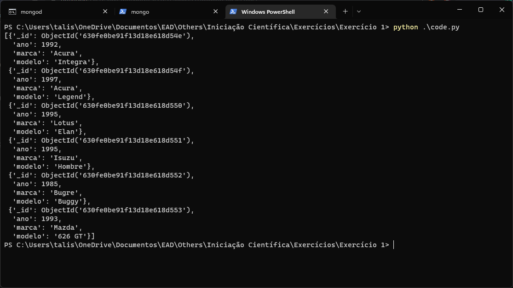
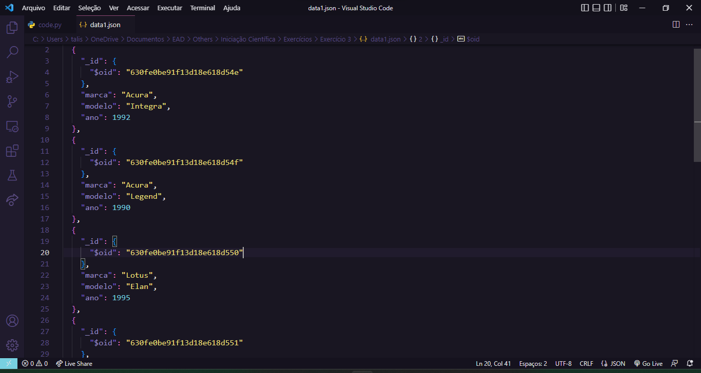

# Exercícios MongoDB

# Exercício 1

Seu Anselmo é um colecionador de carros antigos, este ano participará de um evento para entusiastas onde terá a oportunidade de adquirir alguns veículos de seu interesse. Baseado na experiência e nos eventos anteriores, escreveu uma lista de prováveis veículos disponíveis no evento.

O arquivo JSON abaixo possui todas as informações da lista de Seu Anselmo. A partir dele, crie um banco de dados utilizando o PyMongo e exiba as informações no terminal.

[data.json](4 - Exercícios MongoDB/data.json)

- Solução

  ```python
  import json
  from pprint import pprint
  from pymongo import MongoClient

  client = MongoClient("mongodb://localhost:27017/")

  database = client["veiculos"]
  collection = database["carros"]

  with open('data.json') as file:
      fileData = json.load(file)

  if isinstance(fileData, list):
      collection.insert_many(fileData)
  else:
      collection.insert_one(fileData)

  data = list(collection.find())
  pprint(data)
  ```

- Resultado
  

# Exercício 2

No evento, Seu Anselmo modificou a lista de acordo com os veículos expostos. As seguintes modificações ocorreram:

- Adquiriu o veículo da Mazda, modelo 626 GT, do ano de 1993.
- Percebeu que não tinha mais interesse no Acura Legend de 1997 mas, no de 1990.
- Se interessou pelo veículo da Daewoo, modelo Tico de 1994.

Atualize o banco de dados de acordo com as modificações e exiba o resultado no terminal.

Dica: Veículos adquiridos são removidos da lista e veículos de interesse são adicionados.

- Solução

  ```bash
  from pprint import pprint
  from pymongo import MongoClient

  client = MongoClient("mongodb://localhost:27017/")

  database = client["veiculos"]
  collection = database["carros"]

  newCar = {'marca': 'Mazda', 'modelo': '626 GT', 'ano': 1993}
  collection.delete_one(newCar)

  query = {'marca': 'Acura', 'modelo': 'Legend', 'ano': 1997}
  newAge = {'$set': {'ano': 1990}}
  collection.update_one(query, newAge)

  newCar = {'marca': 'Daewoo', 'modelo': 'Tico', 'ano': 1994}
  collection.insert_one(newCar)

  data = list(collection.find())
  pprint(data)
  ```

- Resultado
  

# Exercício 3

Após as modificações realizadas, exporte o banco de dados como um novo arquivo JSON.

- Solução

  ```bash
  from textwrap import indent
  from bson.json_util import dumps
  from pymongo import MongoClient

  client = MongoClient("mongodb://localhost:27017/")

  database = client["veiculos"]
  collection = database["carros"]

  data = list(collection.find())

  jsonData = dumps(data, indent = 2)

  with open('data1.json', 'w') as file:
    file.write(jsonData)
  ```

- Resultado
  [data1.json](4 - Exercícios MongoDB/data1.json)
  
